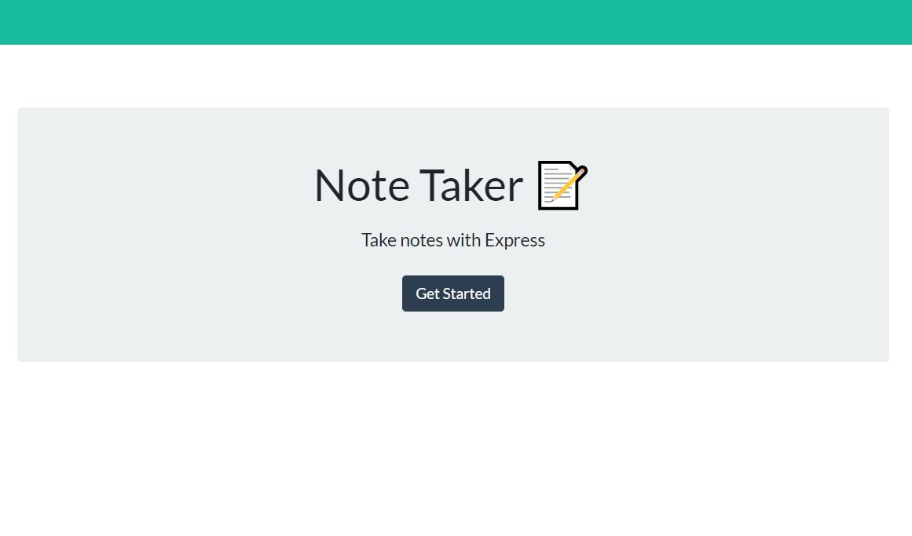

# Note-Taker

  ## Description
  This is an app for the small business owner to keep track of notes and tasks through out a busy day. One can write, save and delete notes.

  This application is created with Node.js using an Express back end with data being saved in a JSON file. Unique ID numbers were created with the UUID npm package. 

  Front end assets were delivered with the task to connect the front and back end and deploy the application to Heroku.

  # Built With
    - HTML
    - Bootstrap
    - CSS
    - JavaScript
    - NodeJS
    - Express
    - UUID

  ## Deployment

  [Heroku](https://immense-stream-74139.herokuapp.com/)
    
  ## Questions
  Please feel free to contact me, webprinc3ss at Github: https://github.com/webprinc3ss 

  or

  djabranton@gmail.com. 
      